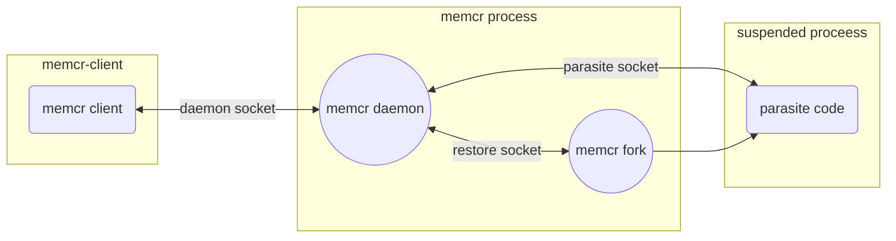

# Security considerations

The memcr operation does require access to suspended process-sensitive data and system resources which are normally allowed to be accessed only by a process owner and a root user. The default examples of memcr usage assume that memcr is run as root, to simplify the initial hands-on and tests. In real-world use it would be better to run memcr as a non-root user, to improve the security of the system using it. This document gives some details about memcr operation, finally, information on how to make it more secure by limiting access to memcr data, and running it as non-root user after granting access to the required resources.

Section [Example: run memcr as non-root user](#example-run-memcr-as-non-root-user) describes an example of a complete integration of memcr running as non-root user.


## memcr socket based communication

### parasite socket

The memcr uses a UNIX domain socket for communication between the parasite (code injected to the suspended process) and memcr utility/daemon, let's call it parasite_socket.
The parasaite_socket is a UNIX domain socket, and depending on the memcr options (`-S --parasite-socket-dir`) can be a named UNIX domain socket created in the pointed directory, or abstract UNIX domain socket.

Using abstract UNIX domain socket is more straightforward as do not require any option to memcr, or take care of the socket ownership and permissions, but it is less secure, as:
- the name/ID of the created socket is generated as: ***memcr\<pid of the suspended process\>*** so it is easy to guess,
- there is no user/permissions-based control over access to abstract UNIX domain sockets, any user in the system can list them and connect to them if they know the socket name.
It is recommended to not use abstract UNIX domain socket in a system where security measures should be applied.

Access to UNIX domain socket file can be controlled by socket file node permissions and ownership. 
By default, parasaite_socket is created as owned by the user running the suspended process, with read+write rights only for the owner. It is enough if memcr is run as root (so it can access any file in the system, despite its ownership).
If the system is configured to be more secure `-G --parasite-socket-gid` option may be specified for memcr to provide group ID which will own the parasite_socket with read+write access to it. This is useful for  integrations where memcr is run as a non-root user with elevated Linux capabilities (see below).

### restore socket

The restore socket is a UNIX domain socket used internally by memcr to communicate between the memcr main process and a child process forked from the memcr watching the suspended process state (one instance created per suspended process).
Analogically to the parasite_socket it is created as named UNIX domain socket (named ***memcrRestore\<pid of the suspended process\>***), or abstract UNIX domain socket depends on `-S --parasite-socket-dir` option.
The owner of the named UNIX domain socket is memcr effective user, permissions are set to read+write for the owner only - which will be the user running memcr daemon.

### daemon socket

The third socket is created when the memcr is run as a daemon (`-l --listen option`) and is used to send the commands to the memcr daemon by the memcr-client utility, let's call it daemon_socket.
The daemon_socket can be a UNIX domain socket created as a file node pointed by `-l` option, or TCP socket listening on port number defined with `-l` option.

For TCP socket, the access to the provided port can be controlled by a network access control mechanism (iptables).

For UNIX domain socket: it is named socket node, by default owned by effective user ID and group ID of the user running memcr daemon, and has file node permissions based on the umask set for the memcr process. (Note, that in most cases it means that running memcr daemon as root will require running memcr-client as root as well.)
By setting the chosen group ID with `-g --listen-gid` option to memcr, one may set the file group ownership to the provided group ID, and file node permission will be set to read+write for the owner and the pointed group.
This way one can limit access to memcr daemon to the user(s) being part of the selected group. It is recommended to create a separate group for that purpose to strictly limit the access.

### communication graph



### socket options examples

1. memcr daemon running as root with TCP daemon socket (port 9000), abstract UNIX domain sockets used for parasite and restore sockets:

```shell
sudo memcr -zc -l 9000
```

memcr client, run as non-root user, connects to TCP socket:

```shell
memcr-client -l 9000 -p <pid> --checkpoint
memcr-client -l 9000 -p <pid> --restore
```

> [!NOTE]
> no memcr daemon access control, no memcr internal sockets protection. Any user can connect to both if knew port / abstract socket naming.

2. memcr daemon running as root with UNIX domain daemon socket, abstract UNIX domain sockets used for parasite and restore sockets:

```shell
sudo memcr -zc -l /tmp/memcr/memcr.sock

/tmp/memcr$ ls -l
total 0
srwxr-xr-x 1 root root 0 gru 31 19:35 memcr.sock
```

memcr client, run as root (to be able to connect to daemon socket owned by root), connects to UNIX domain socket:

```shell
sudo memcr-client -l /tmp/memcr/memcr.sock -p <pid> --checkpoint
sudo memcr-client -l /tmp/memcr/memcr.sock -p <pid> --restore
```

> [!NOTE]
> memcr daemon access control by /tmp/memcr/memcr.sock owner/permissions, no memcr internal sockets (parasite, restore) protection.

3. memcr daemon running as root, with UNIX domain daemon socket, UNIX domain sockets used for parasite and restore sockets, gid 1000 set for daemon and parasite sockets:

```shell
sudo memcr -zc -l /tmp/memcr/memcr.sock -g 1000 -S /tmp/memcr -G 1000

/tmp/memcr$ ls -l
total 0
srw-rw---- 1 root user 0 gru 31 19:38 memcr.sock
```

memcr client, run as non-root user which belongs to group with ID 1000, connects to UNIX domain socket, suspended process pid is: 33239, the user running the suspended process needs to belong to group with ID 1000 as well

```shell
memcr-client -l /tmp/memcr/memcr.sock -p 33239 --checkpoint

/tmp/memcr$ ls -l
total 0
srw-rw---- 1 user user 0 gru 31 19:40 memcr33239
srw------- 1 root root 0 gru 31 19:40 memcrRestore33239
srw-rw---- 1 root user 0 gru 31 19:39 memcr.sock

memcr-client -l /tmp/memcr/memcr.sock -p 33239 --restore
```

> [!NOTE]
> memcr daemon access controled by /tmp/memcr/memcr.sock owner/permissions, memcr parasite and restore sockets (memcr33239, memcrRestore33239) access controlled by sockets file node owner/permissions

## Linux capabilities/filesystem permissions required by memcr to operate

To run memcr as a non-root user it is required to grant to memcr process/user Linux capabilities and filesystem nodes permissions required for memcr operation. Information provided in this section should allow to run memcr (as daemon as well) as non-root, and make your system more secure. Another step recommended for even better security is to run memcr as a daemon in a sandbox, for example using switch root or Linux Container (LXC).

> [!CAUTION]
> Linux capabilities required to effectively freeze the process and dump its memory are real security threats - granting them to a non-root user running the memcr daemon process should be done carefully with a full understanding of the required changes and their consequences. It is recommended to create a separate user and group for memcr daemon, and selectively grant access to the required resources, including /proc data, for the dedicated group.

### CAP_SYS_PTRACE

The memcr process does require Linux capability CAP_SYS_PTRACE to be able to call ptrace() to control the suspeneded process (see ptrace(2) and capabilities(7) for more information).

The setcap command line utility can be used to set a memcr executable file capabilities attribute to the specified capability as "effective+permitted". This way the capability is granted by the OS to the process created by running such a file. (see setcap(8) / getcap(8) for more details).

```shell
sudo setcap 'cap_sys_ptrace=ep' ./memcr

getcap ./memcr
memcr cap_sys_ptrace=ep
```

### /proc access

The memcr does require the following access to data in /proc

1. Read access to /proc/kpageflags node for the memcr.

In most systems, by default it is allowed only: for root to read /proc/kpageflags.
The recommended solution here would be to add read (only) access for a dedicated group, and add only the user running memcr to this group.

2. Read/Write access to data in /proc/\<suspended process pid\>/, for memcr or the suspended process (which serve this data to memcr via socket):

* /proc/\<suspended process pid\>/maps
* /proc/\<suspended process pid\>/ns/net
* /proc/\<suspended process pid\>/status
* /proc/\<suspended process pid\>/task

Access to the above data in most systems is granted to all users to read (+R for others), so memcr can read those directly.

* /proc/\<suspended process pid\>/mem
* /proc/\<suspended process pid\>/pagemap

mem and pagemap nodes are limited to the owner of the process only. In modern Linux system there is no way to change the ownership of the critical /proc entries without modifying the kernel code, so access to those is provided by the memcr parasite code, running as a part of the suspended process.

If memcr daemon is run as root or the same non-root user as the process we want to suspend, memcr will have direct access to all required information in /proc, will read pagemap directly, and use mem if `-m --proc-mem` option is given.

When memcr is run as a non-root user, different from the user running the process we want to suspend, it will use a parasite to read the required information from pagemap, and the memory content. This has some noticeable influence on the performance of the suspend (checkpoint) operation.

## Example: run memcr as non-root user

The example below may be run on any Linux system, its purpose is to show the mechanism and allow to run the example on a sample system. The names of the users, groups, passwords, etc. are examples.

1. Fetch, compile, and install memcr on your system (see [../README.md](../README.md)).
2. Create "memcr" user and group, memcr user will be used to run memcr daemon, memcr group will be used only to grant read access to /proc/kpagefiles for memcr process (no other users shall be added to memcr group)
```
sudo useradd -g memcr -p memcrpass memcr
```
3. Grant read-only access to /proc/kpageflags for memcr group.
```
sudo chown :memcr /proc/kpageflags
sudo chmod g+r /proc/kpageflags
```
4. Create groups: 

"memcrdaemon" - it will be used to grant access to memcr daemon through UNIX domain socket,

"memcrsocket" - a group to share socket between memcr daemon and the memcr parasite code running as part of the suspended process, any user running the process to be suspended should be added to memcrsocket group,
```
sudo groupadd memcrsocket
sudo groupadd memcrdaemon
sudo usermod -a -G memcrsocket,memcrdaemon memcr
```
5. Create "memcrlient" user which will run memcr-client, and will have access to memcr daemon through memcrdaemon group. Only memcr and memcrclient belong to memcrdaemon group.
```
sudo useradd -G memcrsocket,memcrdaemon -p memcrpass memcrclient
```
6. Grant CAP_SYS_PTRACE Linux capablity to memcr executable:
```
sudo setcap 'cap_sys_ptrace=ep' ./memcr
```
7. Grant read access to  memcr executable and libmemcrencrypt.so to memcr group
```
sudo chown :memcr ./memcr
sudo chown :memcr ./libmemcrencrypt.so
```
8. Create a location for memcr sockets
```
mkdir /tmp/memcr
sudo chown :memcrsocket /tmp/memcr
```
9. Note: when memcr executable has Linux capabilities granted and it is run as non-root, ld, when run it, switches to [secure-execution mode](https://manpages.debian.org/bookworm/manpages/ld.so.8.en.html#Secure-execution_mode) which effectively disable the LD_PREALOAD feature, and makes encryption library preloading not possible. 
If you want to use encryption library, the following conditions need to be fulfilled: (from [LD_PRELOAD documentation](https://manpages.debian.org/bookworm/manpages/ld.so.8.en.html#LD_PRELOAD)):
>In secure execution mode, preload pathnames containing slashes are ignored. Furthermore, shared objects are preloaded only from the standard search directories and only if they have set-user-ID mode bit enabled (which is not typical).

10. Run memcr deaemon as memcr user, with encryption, compression, sockets in /tmp/memcr. 

Note: `-m --proc-mem` option cannot be used when memcr is run as non-root due to lack of access to /proc/mem.
```
sudo -u memcr LD_PRELOAD=./libmemcrencrypt.so ./memcr -zce -S /tmp/memcr -G `cat /etc/group | grep memcrsocket | cut -d: -f3` -l /tmp/memcr/memcr.sock -g `cat /etc/group | grep memcrdaemon | cut -d: -f3`
```
11. Add the user running the process to suspend to memcrsocket group:
```
sudo usermod -a -G memcrsocket ${USER}
```

12. Call the memcr-client, running as memcrclient user, to suspend the process:
```
sudo -u memcrclient ./memcr-client -l /tmp/memcr/memcr.sock -p ${SAMPLE_PROCESS_PID} -c
```
